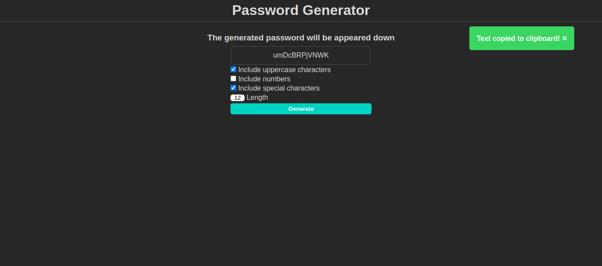

# Password Generator


## Description
Beginner JavaScript app for generate random passwords with some parameters as "include numbers", or "include special characters".

## How to try it
- Just clone the repository
    ```
    git clone https://github.com/manuelIsCoding/password-generator.git
    ```
- and open the index.html file through _file://_ protocol in your browser.
